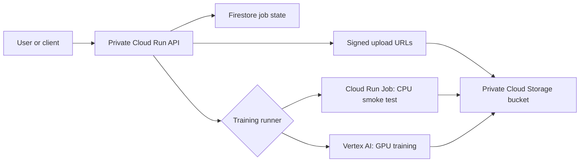

# LoRA Training Platform on Google Cloud

This project is a small platform for training a LoRA model from a private set of images. It uses containers and Google Cloud services. The main goal is to make each training job easy to start, follow, repeat, and remove.

The code is ready for development and another test deployment. There is no active project infrastructure in Google Cloud now. We removed the test environment after the first remote test, so it does not keep using cloud resources.

## What we built

The repository has three main parts:

- A Node.js API that creates and follows training jobs.
- A Python trainer that checks images and can train an SDXL LoRA.
- Terraform modules that create and remove the Google Cloud infrastructure.

The normal flow looks like this:



The client sends image information to the API. The API returns short-lived signed URLs. The client uploads the images directly to the private bucket. The API checks every uploaded object before it starts a job. The trainer reads the images and writes its result back to the same private bucket.

## Current status

The current work is in the `Feature3TrainingPipeline` branch.

| Area | Status |
| --- | --- |
| Modular Terraform foundation | Ready and validated |
| Private Cloud Run API | Ready |
| Firestore job tracking | Ready |
| Signed private image uploads | Ready |
| Trainer image validation | Ready |
| CPU smoke mode | Ready in code |
| Cloud Run Job smoke runner | Ready in code, not tested remotely yet |
| Vertex AI runner | Ready in code, blocked by trial quota during the test |
| SDXL LoRA training code | Ready for a controlled GPU test |
| Active GCP infrastructure | None |

The first remote test reached the following steps:

1. Terraform created the development environment.
2. Cloud Build created the API and trainer images.
3. The private API passed its health check.
4. The API created a training job.
5. Four synthetic PNG images were uploaded successfully.
6. Vertex AI rejected the job before starting a machine.

Google Cloud returned this error:

```text
RESOURCE_EXHAUSTED:
The following quota metrics exceed quota limits:
aiplatform.googleapis.com/custom_model_training_cpus
```

The billing account was still in the USD 300 free trial. During this trial, Google does not allow quota increase requests or GPU use. No training machine or GPU started, and no LoRA training cost was created.

We added a Cloud Run Job runner after this result. It gives us a CPU option for the next smoke test. We did not deploy this new runner because we chose to remove the test environment first.

## Training modes

The trainer has two modes:

### `smoke`

This mode downloads the images, opens them, checks them, prepares them, and writes `metadata.json`. It does not download SDXL and does not need a GPU. Use this mode for the first test after every important infrastructure change.

### `train`

This mode runs the real SDXL LoRA training flow. A successful job writes:

- `metadata.json`
- `pytorch_lora_weights.safetensors`

Use this mode only after the smoke test passes. Confirm the model license, image permission, GPU quota, expected time, and budget before starting it.

## Training runners

The API supports two remote runners:

- `cloud_run`: intended for the CPU smoke test.
- `vertex`: intended for managed GPU training.

Set the runner in the environment Terraform variables:

```hcl
trainer_mode      = "smoke"
training_platform = "cloud_run"
```

Do not use the Cloud Run CPU job for a real SDXL training run. It would be slow and is not the target design. For real training, use Vertex AI after the billing account and GPU quota are ready.

## Repository layout

```text
api/                         Node.js and Express orchestration API
trainer/                     Python image checks and SDXL LoRA trainer
infra/bootstrap/             Terraform state bucket
infra/environments/dev/      Development environment composition
infra/modules/               Reusable Google Cloud modules
infra/scripts/               Safe destroy helper
scripts/                     End-to-end smoke test client
docs/                        More focused technical guides
.github/workflows/           API, trainer, and Terraform checks
```

## Branches

The work was split into three remote branches:

| Branch | Purpose |
| --- | --- |
| `Feature1IaC` | First Terraform foundation |
| `Feature2Api` | Cloud Run API foundation |
| `Feature3TrainingPipeline` | Trainer, remote runners, smoke flow, and latest fixes |

`main` was not changed during this work.

## Local tooling rules

This project does not need new global package installations.

- Use the existing Terraform installation on the computer.
- Node.js packages stay inside `api/node_modules`.
- Python test packages should stay inside a local `.venv`.
- Trainer runtime packages are installed inside the trainer container.
- Environment files, Terraform state, plans, backend files, and real variable files are ignored by Git.

Do not commit service-account keys, access tokens, `.env` files, `terraform.tfvars`, `backend.hcl`, or training images.

## Run the local checks

### API

Install the locked packages inside the API directory:

```powershell
Set-Location api
npm ci
npm run lint
npm run typecheck
npm test
npm run build
Set-Location ..
```

### Trainer

Create a project-only Python environment:

```powershell
Set-Location trainer
python -m venv .venv
.\.venv\Scripts\Activate.ps1
python -m pip install --requirement requirements-test.txt
python -m compileall -q src
python -m unittest discover -s test -v
deactivate
Set-Location ..
```

### Terraform

Terraform is already installed on the development computer. Do not copy its executable into this repository.

```powershell
$terraform = Join-Path $env:LOCALAPPDATA 'Programs\Terraform\terraform.exe'
& $terraform fmt -check -recursive infra
& $terraform '-chdir=infra\bootstrap' init '-backend=false' '-input=false'
& $terraform '-chdir=infra\bootstrap' validate
& $terraform '-chdir=infra\environments\dev' init '-backend=false' '-input=false'
& $terraform '-chdir=infra\environments\dev' validate
```

## Prepare a new development deployment

The Google Cloud project must already exist and have billing enabled. The user running Terraform must have permission to enable APIs, create IAM resources, and create the platform resources.

Create local configuration files from the examples:

```powershell
Copy-Item infra/bootstrap/terraform.tfvars.example infra/bootstrap/terraform.tfvars
Copy-Item infra/environments/dev/backend.hcl.example infra/environments/dev/backend.hcl
Copy-Item infra/environments/dev/terraform.tfvars.example infra/environments/dev/terraform.tfvars
```

Edit the copied files with the project ID, region, labels, state bucket, image URIs, and allowed API callers. These copied files are local and ignored by Git.

The safe deployment order is:

1. Apply `infra/bootstrap` to create the remote state bucket.
2. Initialize `infra/environments/dev` with `backend.hcl`.
3. Keep `deploy_api = false` and apply the foundation.
4. Build the API and trainer containers with Cloud Build.
5. Use immutable image digests in `terraform.tfvars`.
6. Set `deploy_api = true`, `trainer_mode = "smoke"`, and `training_platform = "cloud_run"`.
7. Review the Terraform plan and apply it.
8. Check the private API health endpoint with an identity token.
9. Run the smoke test with four synthetic or authorized images.

The focused smoke instructions are in [docs/remote-smoke-test.md](docs/remote-smoke-test.md).

## API endpoints

The API exposes these routes:

| Method and path | Purpose |
| --- | --- |
| `GET /health` | Check service health and version |
| `POST /v1/training-jobs` | Create a job and receive upload URLs |
| `POST /v1/training-jobs/{jobId}/start` | Check images and start the remote runner |
| `GET /v1/training-jobs/{jobId}` | Read and update the current job status |

Cloud Run protects the API. The application does not store user passwords, service-account keys, or long-lived tokens.

## Run a remote smoke test

After deployment, get a short-lived identity token and run:

```powershell
.\scripts\smoke-training-job.ps1 `
  -ApiUrl 'https://your-private-api.run.app' `
  -IdentityToken '<short-lived-identity-token>' `
  -ImagePath @(
    '.\samples\01.png',
    '.\samples\02.png',
    '.\samples\03.png',
    '.\samples\04.png'
  )
```

Use images that you own or have permission to use. The script creates a job, uploads every image, starts the runner, waits for a final status, and prints the result.

## Remove the complete environment

Run this command from the repository root:

```powershell
.\infra\scripts\destroy-environment.ps1 -Environment dev -IncludeBootstrap
```

The script asks you to type the exact environment name. It then:

1. Initializes the remote backend.
2. Creates and shows a saved destroy plan.
3. Applies that exact plan.
4. Confirms that the environment state is empty.
5. Removes the state bucket only after the environment is gone.
6. Confirms that the bootstrap state is empty.

The development data bucket uses `force_destroy`. Firestore and Cloud Run have deletion protection disabled. Terraform also owns the Artifact Registry repository and the enabled project APIs. This design allows a full cleanup of the disposable development environment.

## State after the last cleanup

The last review confirmed:

- Zero resources in the environment Terraform state.
- Zero resources in the bootstrap Terraform state.
- The two project buckets no longer exist.
- The two LoRA service accounts no longer exist.
- All APIs managed by this Terraform stack are disabled.
- The three source archives created by our Cloud Builds were removed.
- Older Cloud Build files from the existing test project were kept.
- The Git working tree is clean and all three feature branches exist remotely.

The shared Cloud Build bucket has a seven-day soft-delete policy. Its three deleted source archives can stay as recoverable internal versions until that period ends. They are not active objects and will expire automatically.

## Next step

The next useful step is a new CPU smoke deployment with `training_platform = "cloud_run"`. If it passes, the project is ready for a small GPU training test after the Google Cloud billing account is upgraded and the required Vertex AI quota is available.
